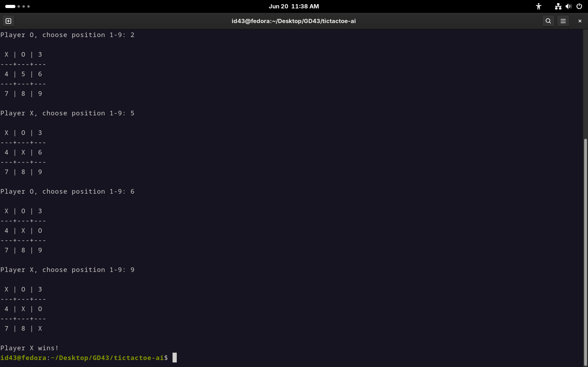

# AI Research Lab — Minimax & Alpha-Beta Pruning

A lightweight **algorithm research branch** exploring core game AI **Alpha-Beta pruning optimization**.

This branch is used to prototype and understand AI logic before integrating it into larger projects like a full chess engine.

---

## Purpose

This repository is not a standalone game. It is a **learning and experimentation space** for:

* Game tree search algorithms
* Optimal decision-making in turn-based games
* Performance optimization using pruning techniques
* Applying AI concepts to simple games (starting with Tic-Tac-Toe)

---

## Current Experiment

### Tic-Tac-Toe AI

A fully playable console-based Tic-Tac-Toe implementation enhanced with:

* Alpha-Beta pruning optimization (in progress/experimental)
* Perfect-play AI behavior
* Move evaluation based on game outcome prediction

### Goals of this implementation

* Observe Alpha-Beta performance
* Understand branching factor reduction
* Measure decision depth vs computation cost
* Build reusable logic for future chess AI integration

---

## Key Concepts Implemented

### Alpha-Beta Pruning

* Optimizes Minimax by eliminating unnecessary branches
* Reduces search space without affecting correctness
* Critical step toward scalable chess AI

---

## What I’m Learning Here

* How AI evaluates future game states
* Trade-offs between depth and performance
* Why pruning is essential for complex games like chess
* How to structure reusable AI modules

---

## Screenshot 

## Future Integration

The final goal is to port these concepts into:

### Retro Chess AI Module

Planned integration:

* `ai.js` for move selection
* Chess-specific evaluation function
* Optimized Alpha-Beta pruning search
* Iterative deepening for real-time play

---

## Next Steps

* Extend Alpha-Beta to full chess move generator
* Add heuristic evaluation functions
* Implement depth-limited search
* Compare performance against random move baseline
* Visualize search tree (optional future upgrade)

---

## Related Project

This work directly supports:

**Retro Chess (Main Project)**
A browser-based chess engine with full rule implementation and UI.

This branch acts as the **algorithm sandbox** behind it.

